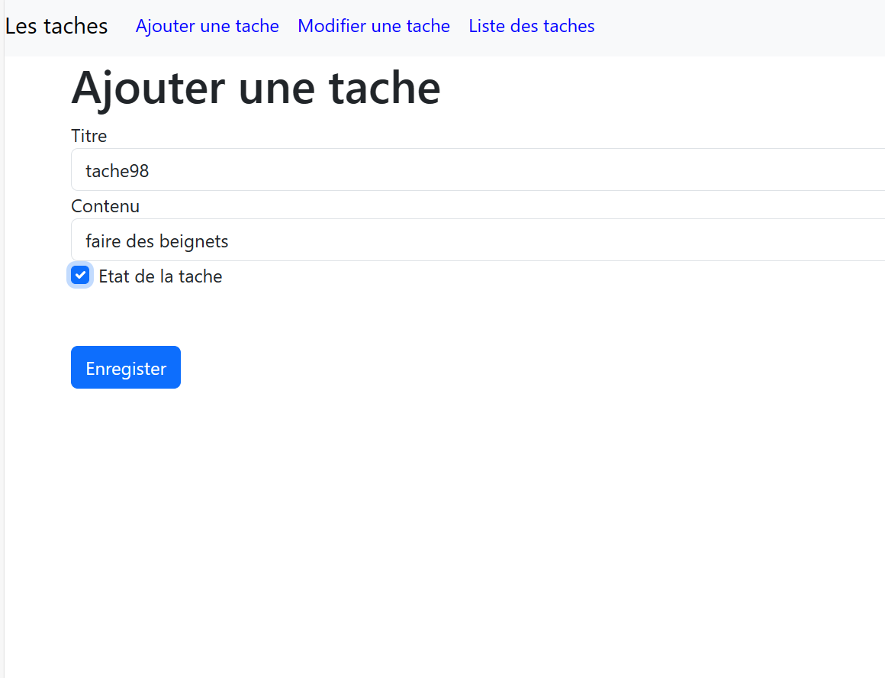
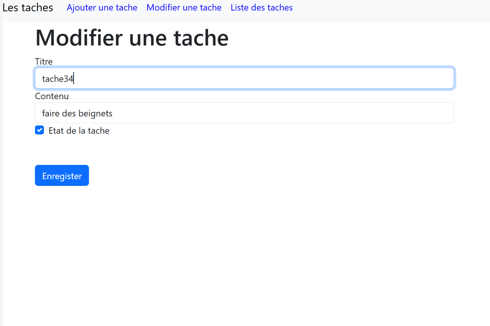

## Outil utilisé pour le devoir

`localStorage` est un objet JavaScript intégré qui offre un moyen simple de stocker des données sous forme de paires clé/valeur de manière persistante sur le côté client

## resultat

 la page d'interface 

 
 Ajouter une tache 

Modifier une tache

